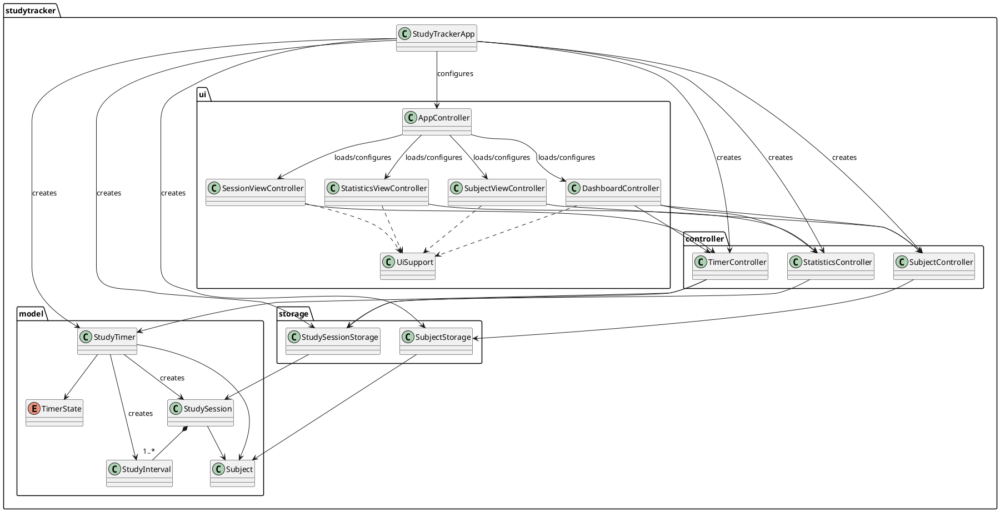

# Study Tracker Developer Guide

## Acknowledgements

| Dependency | Purpose |
| --- | --- |
| Java 25 | Runtime and language. |
| Gradle | Builds, dependencies, and tests. |
| OpenJFX and its Gradle plugin | JavaFX GUI, FXML, charts, and native dependencies. |
| Jackson Databind and JSR-310 | JSON persistence and Java-time support. |
| JUnit Jupiter | Automated tests. |
| Gradle Shadow Plugin | Distribution JAR packaging. |

Consult the OpenJFX, Java `java.time`, Jackson, and JUnit 5 documentation for the dependencies above.

## Architecture of the App

Study Tracker uses an MVC-inspired design: the UI receives input and displays results; application controllers coordinate use cases; models validate domain state; storage classes persist JSON.



`StudyTrackerApp` creates one shared `StudyTimer`, storage objects, and application controllers. It loads `app.fxml`, and `AppController` passes the shared controllers to whichever FXML screen it loads. Timer actions flow from Dashboard to `TimerController`, then `StudyTimer`; stopping saves a `StudySession`. Statistics load sessions and calculate active-interval overlap with the requested dates.

## UI Components

| Resource | Responsibility |
| --- | --- |
| `app.fxml` / `AppController` | Root shell, navigation, view loading, and dependency injection. |
| `dashboard.fxml` / `DashboardController` | Timer lifecycle, live `Timeline`, daily totals, and recent sessions. |
| `subjects.fxml` / `SubjectViewController` | Subject add/delete actions and subject table. |
| `sessions.fxml` / `SessionViewController` | Session history and start-date filtering. |
| `statistics.fxml` / `StatisticsViewController` | Date validation, totals, and subject bar chart. |
| `UiSupport` | Duration formatting and error dialogs. |
| `app.css` | Navigation, card, table, chart, and button styling. |

`AppController` disposes the Dashboard timeline when navigating away, avoiding background refresh work.

## Controller Components

### `TimerController`

Starts, pauses, resumes, and stops `StudyTimer`; saves stopped sessions; exposes state, active duration, and past sessions.

### `SubjectController`

Loads and adds subjects, rejects case-insensitive duplicate names, and deletes subjects by index.

### `StatisticsController`

Calculates total active time and time by subject for inclusive date ranges using active-interval overlap rather than only session start dates.

## Model Components

| Component | Responsibility |
| --- | --- |
| `Subject` | Subject name. |
| `TimerState` | `NOT_STARTED`, `RUNNING`, and `PAUSED`. |
| `StudyInterval` | One validated uninterrupted active period. |
| `StudySession` | Subject plus non-empty immutable interval list; derives start, end, and duration. |
| `StudyTimer` | Current timer and interval creation on pause/stop. |

## Storage Components

`SubjectStorage` reads and writes `subjects.json`. `StudySessionStorage` reads and appends `sessions.json`, configures Jackson Java-time support, and creates parent folders on save. Sessions persist their subject and active intervals. Model field, constructor, or JSON annotation changes should preserve this schema or provide a migration.

## Noteworthy Features

### Active Intervals

Durations alone cannot show when a user studied around pauses. Every uninterrupted run is stored as a `StudyInterval`; `StudySession` derives start, end, and duration from intervals, preventing inconsistent duplicated data.

### Overnight Statistics

An inclusive user range is implemented as `[start date at 00:00, day after end date at 00:00)`. Each interval is clipped to this range. An interval from `23:00` to `00:30` therefore contributes 30 minutes to the second date; paused gaps are excluded.

### Persistence and Lifecycle

FXML creates screen controllers before `AppController` injects shared dependencies, preventing duplicate timers or storage instances. An active or paused timer is saved only when stopped, so closing the application loses that unfinished session.

## Testing

Run the JUnit suite with `./gradlew test`, or `.\gradlew.bat test` on Windows. Tests are in `src/test/java/`; JSON fixtures are in `src/test/resources/studytracker/fixtures/`.

| Area | Example coverage |
| --- | --- |
| Model | Subject changes, interval validation, derived session values, timer state transitions, and reset. |
| Storage | Missing files, directory creation, JSON round trips, append/replace behavior, and interval comparisons. |
| Subject controller | Addition, duplicate rejection, deletion, and invalid indices. |
| Statistics controller | Single-day totals, inclusive bounds, empty periods, cross-midnight pauses, partial overlap, and multi-year ranges. |

### Cross-Midnight Test Example

```text
Active interval: 23 Aug 2026, 23:00-24 Aug 2026, 00:30
Requested date: 24 Aug 2026
Expected active time: 30 minutes
```

This verifies that statistics clip an interval to the requested period instead of excluding it because the session began on the previous date.
